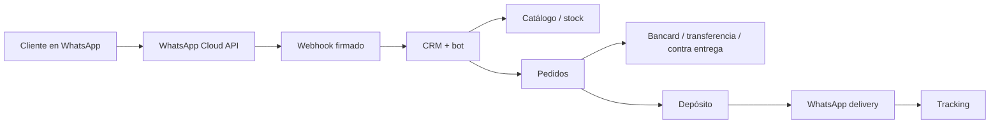

# VentasBot Platform

SaaS multiempresa propio para vender, cobrar, preparar y entregar pedidos iniciados en WhatsApp. Usa la API oficial de WhatsApp Cloud de Meta y mantiene cada secreto fuera de la base de datos.

## Funcionalidad actual

- Login por empresa y superadministración de empresas/demo.
- Catálogo, stock, clientes, pedidos, auditoría y aislamiento por `tenant_id`.
- CRM bot/humano, asignación y mensajes salientes.
- Webhooks Meta firmados e idempotentes.
- Carrito de catálogo → ubicación → horario → pago → depósito.
- Pago al recibir, transferencia y adaptador configurable Bancard Tpago.
- Preparación, delivery, aviso por WhatsApp y tracking con timeline.
- Panel responsive y datos demo reproducibles.

## Arquitectura

Monolito modular FastAPI + SQLAlchemy, preparado para PostgreSQL. Permite validar el negocio y separar workers, tracking o facturación cuando el volumen lo justifique.



VendeyaPy, MetaBots, CrediPower, Arfagi y Company360 sirvieron como referencias de dominio, seguridad y operación; esta plataforma consolida contratos y código propios.

## Inicio local

```powershell
python -m venv .venv
.venv\Scripts\python.exe -m pip install -r requirements-dev.txt
Copy-Item .env.example .env
.venv\Scripts\python.exe -m app.seed
.venv\Scripts\python.exe -m uvicorn app.main:app --reload --port 8099
```

Definí `JWT_SECRET`, `SUPERADMIN_PASSWORD` y, para el comercio demo, `SEED_DEMO=1` y `DEMO_PASSWORD`. Panel: `http://localhost:8099/panel/`. OpenAPI: `http://localhost:8099/docs`.

## WhatsApp y secretos

Producción usa `/webhooks/meta`. Configurá cada empresa en `PUT /api/tenants/{id}/integrations/whatsapp`; `access_token_env` contiene solo el nombre de una variable del servidor. En Meta cargá la URL HTTPS, `VERIFY_TOKEN`, `APP_SECRET` y la suscripción `messages`. `/webhook` queda solo para compatibilidad del prototipo inicial y no debe usarse en una cuenta productiva.

## Pagos

Los métodos se habilitan por empresa en `/api/tenants/{id}/payment-methods/{code}`. El adaptador `BANCARD` usa la API oficial Tpago para generar un enlace compartible en WhatsApp; referencia variables para claves y códigos de comercio/sucursal. Los datos de tarjeta se ingresan en el checkout del adquirente, nunca en VentasBot. “Sin salir de WhatsApp” significa abrir ese checkout en el navegador integrado. La confirmación cifrada del callback y homologación final requieren sandbox y credenciales comerciales de Bancard.

## Pruebas

```powershell
.venv\Scripts\python.exe -m pytest -q
node --check app/static/app.js
```

Cubren firma/handshake Meta, texto/ubicación/carrito, login, aislamiento, pedido/pago/stock, idempotencia, conversación y estados de delivery.

Antes de un piloto: PostgreSQL, migraciones, HTTPS, backups, secret manager, rate limiting, cola durable, homologación Bancard y módulo SIFEN. Ver [roadmap](docs/ROADMAP.md) y [seguridad](docs/SECURITY.md).
