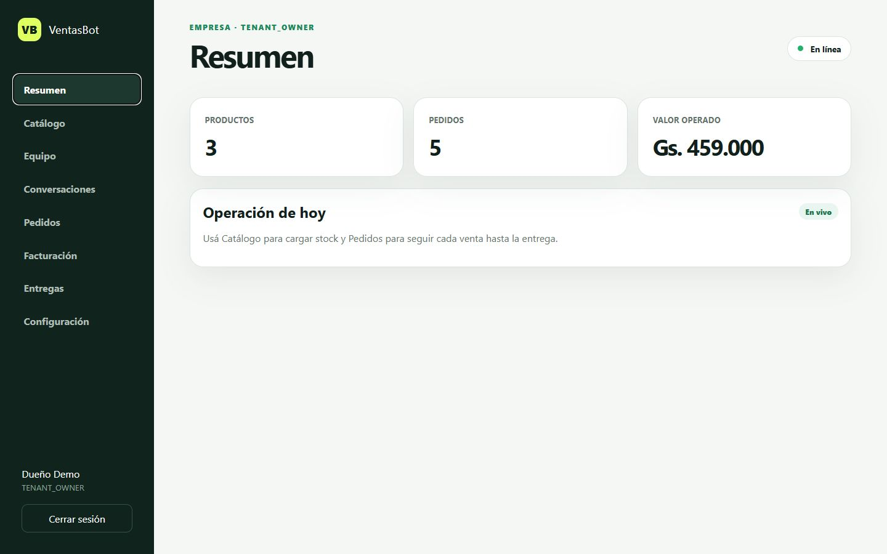
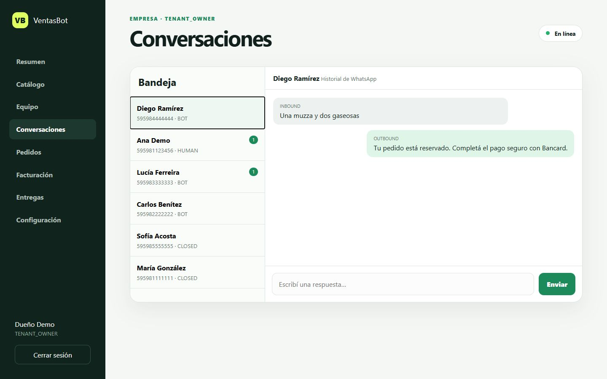
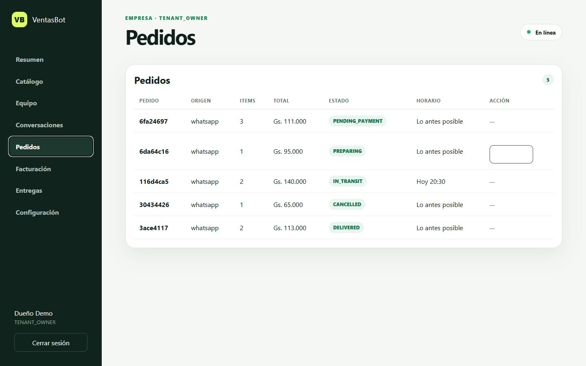
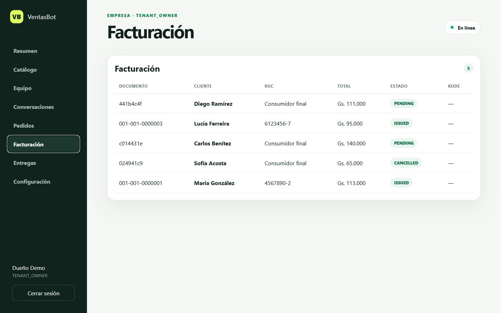
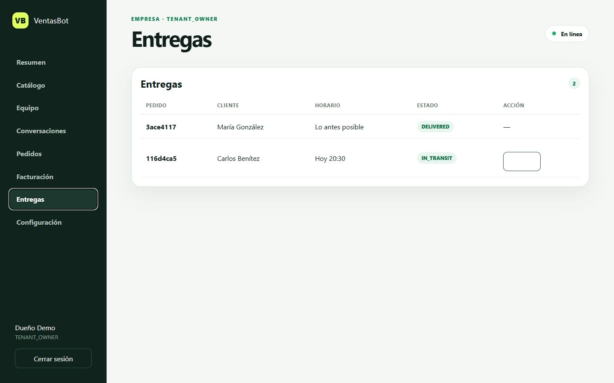
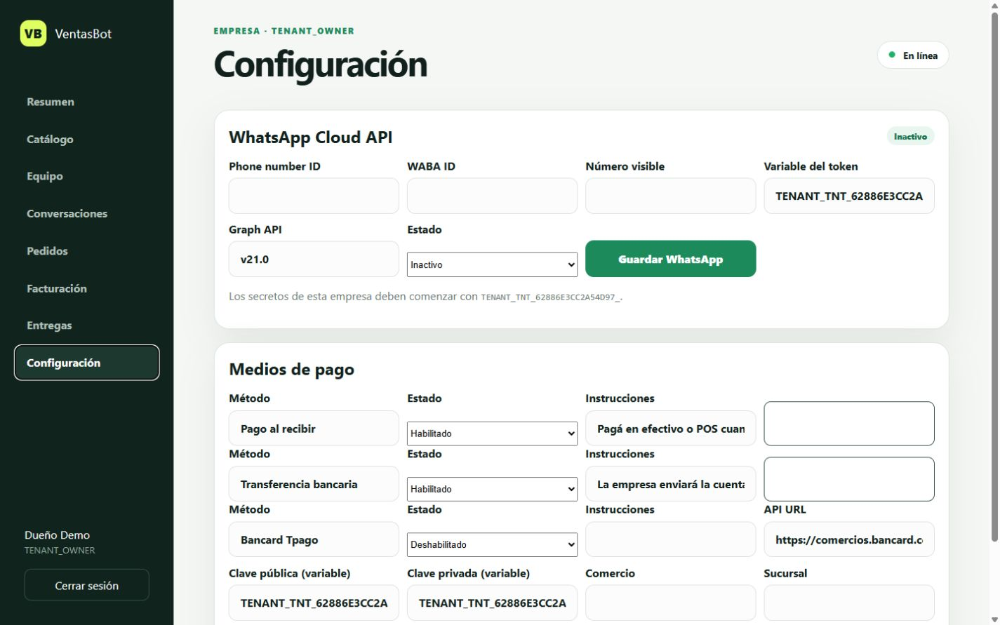

# Manual de uso de VentasBot Platform

Versión de demostración · Agosto de 2026

## 1. Qué es VentasBot

VentasBot es una plataforma SaaS multiempresa para centralizar ventas iniciadas en WhatsApp. Reúne catálogo, conversaciones, pedidos, pagos, facturación, asignación de delivery y seguimiento en un solo panel.

La empresa demo incluida es **Pizzería Demo** y contiene datos ficticios para capacitación. Ningún cliente, pago o documento del historial demo es real.

## 2. Acceso a la demostración

1. Abrir `http://127.0.0.1:8000/panel/`.
2. Completar **Empresa** con `pizzeria-demo`.
3. Completar **Correo** con `demo@ventasbot.local`.
4. Completar **Contraseña** con `VentasBotDemo2026!`.
5. Presionar **Entrar al panel**.

El superadministrador usa `admin@ventasbot.local`, contraseña `VentasBotAdmin2026!` y deja Empresa vacía. Estas credenciales son exclusivamente locales y deben cambiarse antes de publicar.

## 3. Datos incluidos en el historial demo

Al ejecutar `python -m app.seed`, el sistema crea de manera idempotente:

- 3 productos con stock.
- 6 clientes y 6 conversaciones.
- 5 pedidos de WhatsApp.
- 5 registros de pago.
- 5 registros de factura.
- 2 entregas con eventos de tracking.

Los pedidos representan cinco escenarios: pago pendiente, preparación, entrega en tránsito, pedido entregado y pedido cancelado.

## 4. Resumen

El Resumen muestra la cantidad de productos, pedidos y el valor total operado. Sirve como vista rápida para el dueño o responsable del negocio.



Interpretación del ejemplo:

- **Productos:** artículos activos del catálogo.
- **Pedidos:** ventas creadas en el tenant actual.
- **Valor operado:** suma de pedidos no cancelados; no equivale necesariamente a dinero cobrado.

## 5. Catálogo

Desde Catálogo se agregan productos indicando SKU, nombre, precio en guaraníes y stock. El SKU debe ser único dentro de cada empresa.

Flujo recomendado:

1. Crear o sincronizar el producto.
2. Revisar precio y stock.
3. Mantenerlo activo solamente si puede venderse.
4. Conectar posteriormente Meta Catalog o la fuente web desde Configuración.

## 6. Conversaciones

Conversaciones es la bandeja de atención de WhatsApp. La columna izquierda muestra clientes, estado y mensajes pendientes. Al elegir un cliente aparece el historial y el cuadro para responder.



Estados de conversación:

- **BOT:** el flujo automático está atendiendo.
- **HUMAN:** un operador tomó la conversación.
- **CLOSED:** la atención terminó.

Antes de conectar Meta, las respuestas se registran en el CRM pero no se envían a un número real.

## 7. Pedidos

Pedidos concentra las ventas y permite seguir su avance operativo.



Secuencia normal:

1. `PENDING_CONFIRMATION`: faltan confirmaciones del cliente.
2. `PENDING_PAYMENT`: espera pago o comprobante.
3. `CONFIRMED`: venta segura y aceptada.
4. `PREPARING`: depósito o cocina prepara.
5. `READY`: pedido listo para despacho.
6. `ASSIGNED`: delivery asignado.
7. `IN_TRANSIT`: pedido en camino.
8. `DELIVERED`: entrega completada.

`CANCELLED` cierra el pedido y libera el stock reservado cuando corresponde.

## 8. Facturación

Facturación almacena los datos fiscales proporcionados por el cliente, el importe y el estado del documento.



Estados:

- **PENDING:** registro preparado, pendiente de emisión.
- **ISSUED:** documento emitido; puede contener número y enlace KuDE.
- **CANCELLED:** factura anulada o vinculada a un pedido cancelado.

La demo usa registros SIFEN simulados. La emisión fiscal real requiere homologación, certificado y credenciales del contribuyente.

## 9. Entregas y tracking

Entregas muestra los pedidos asignados a delivery, el cliente, el horario solicitado y el estado actual.



Secuencia de tracking:

1. `PENDING`: todavía sin asignación.
2. `ASSIGNED`: repartidor designado.
3. `PICKED_UP`: pedido retirado del depósito.
4. `IN_TRANSIT`: en camino al cliente.
5. `ARRIVED`: delivery llegó al destino.
6. `DELIVERED`: entrega finalizada.
7. `FAILED`: no fue posible completar la entrega.

La ubicación y el contacto del cliente solo deben compartirse con el delivery asignado y durante el tiempo necesario para cumplir el pedido.

## 10. Agente comercial

Esta pantalla configura el playbook independiente de cada empresa y muestra las respuestas que esperan revisión.

- **Borrador con aprobación:** el bot califica al lead y propone una respuesta; un vendedor puede editarla, aprobarla o rechazarla.
- **Automático por confianza:** sólo envía respuestas cuando la confianza alcanza el umbral definido.
- **Temperatura y puntaje:** clasifica cada oportunidad como COLD, WARM o HOT y registra intención, urgencia y presupuesto estimado.
- **Objeciones:** cada línea contiene un nombre, frases disparadoras y una respuesta previamente aprobada por la empresa.
- **Escalamiento:** palabras sensibles como reclamo, denuncia o humano detienen el bot y transfieren la conversación.
- **Auditoría:** cada ejecución conserva intención, decisión, confianza y los pasos realizados.

El agente nunca confirma pagos ni cambia stock, facturas o estados de pedidos. Esas operaciones permanecen en los servicios transaccionales de la plataforma.

## 11. Configuración e integraciones

Configuración reúne las conexiones propias de cada empresa.



Componentes principales:

- **Meta WhatsApp Cloud API:** Phone Number ID, WABA, versión y variable segura del token.
- **Bancard:** URL autorizada, comercio, sucursal, retorno y variables de claves.
- **Transferencia y contra entrega:** instrucciones visibles para el cliente.
- **Fuentes de catálogo:** Meta, web, WhatsApp Business, CSV o API.

Las claves privadas nunca deben escribirse en mensajes, documentación o código. Se guardan como variables de entorno.

## 12. Roles

- **PLATFORM_ADMIN:** administra empresas y demos de toda la plataforma.
- **TENANT_OWNER:** controla su empresa, usuarios e integraciones.
- **TENANT_MANAGER:** supervisa la operación de la empresa.
- **SELLER:** atiende conversaciones y ventas.
- **WAREHOUSE:** prepara pedidos y stock.
- **DISPATCHER:** asigna y supervisa entregas.
- **DRIVER:** actualiza el recorrido del pedido asignado.

## 13. Recorrido de prueba recomendado

1. Iniciar sesión como Pizzería Demo.
2. Revisar Resumen y confirmar cinco pedidos.
3. Abrir Conversaciones y comparar un chat BOT con uno CLOSED.
4. Abrir Pedidos y localizar los cinco estados de ejemplo.
5. Abrir Agente comercial, revisar el modo borrador y guardar una objeción de prueba.
6. Aprobar o rechazar una sugerencia si aparece en la bandeja.
7. Marcar el pedido PREPARING como READY.
8. Abrir Facturación y distinguir PENDING, ISSUED y CANCELLED.
9. Abrir Entregas y avanzar la entrega IN_TRANSIT a ARRIVED.
10. Revisar Configuración sin colocar todavía credenciales reales.

## 14. Reiniciar o completar la demo

Desde PowerShell, dentro del proyecto:

```powershell
.\.venv-clean\Scripts\python.exe -m app.seed
.\.venv-clean\Scripts\python.exe -m uvicorn app.main:app --reload
```

El seed puede ejecutarse nuevamente sin duplicar el historial. Si se desea una base completamente nueva, debe hacerse una copia de seguridad antes de eliminar la base local.

## 15. Uso en Google NotebookLM

1. Abrir NotebookLM y crear un cuaderno nuevo.
2. Elegir **Añadir fuente**.
3. Subir este archivo `MANUAL_NOTEBOOKLM.md` o el manual Word.
4. Agregar también `README.md`, `docs/ROADMAP.md` y `docs/SECURITY.md` para ampliar el conocimiento técnico.
5. Pedir a NotebookLM: “Creá una guía de capacitación por roles basada únicamente en estas fuentes”.

Prompts útiles:

- “Explicame el recorrido completo desde el mensaje de WhatsApp hasta la entrega”.
- “Creá un checklist diario para depósito y despacho”.
- “Compará los permisos de cada rol”.
- “Prepará preguntas frecuentes para capacitar a una empresa nueva”.
- “Indicá qué funciones son demo y cuáles requieren credenciales u homologación”.

## 16. Límites de la demostración

- Meta no envía ni recibe mensajes reales sin credenciales verificadas.
- Bancard no procesa dinero real sin comercio habilitado y ambiente homologado.
- SIFEN no emite documentos tributarios reales sin homologación y certificados.
- La base SQLite es adecuada para prueba local; producción debe usar PostgreSQL, HTTPS, backups y monitoreo.
